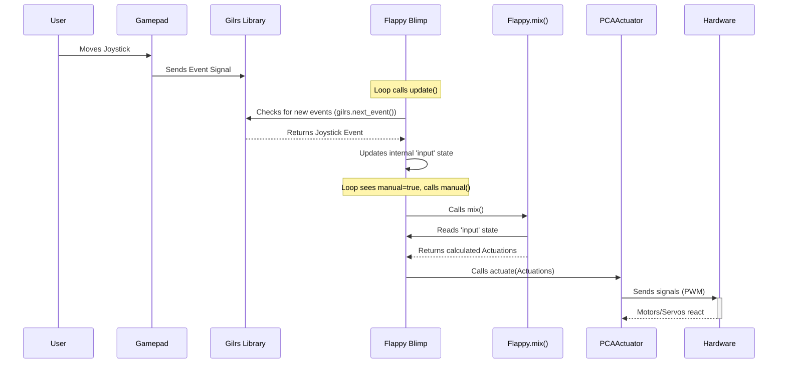

# Chapter 1: Blimp Control (`Blimp` Trait / `Flappy` Implementation)

Welcome to the SanoBlimpSoftware project! This is the first step in understanding how our blimp thinks and moves.

Imagine you have a remote-controlled blimp. How does it know whether to go forward when you push the joystick, or how to fly on its own to a specific target? We need a "brain" or a "pilot" inside the software to handle these decisions. That's exactly what this chapter is about!

We'll explore the core control system of the blimp. Think of it like the **driver of a car**. The driver takes input:
*   From you turning the steering wheel and pressing pedals (Manual Control).
*   Or, from a self-driving computer system (Autonomous Control).

Based on this input, the driver decides exactly how much gas, brake, or steering to apply to make the car move. Our blimp's software pilot does the same thing for its motors and control surfaces.

In our project, this "driver" concept is defined by a set of rules called the `Blimp` **trait**, and we have a specific driver implementation called `Flappy`.

## Key Concepts

Let's break down the main ideas:

### 1. The `Blimp` Trait (The Rulebook)

In Rust (the programming language we're using), a **trait** is like a blueprint or a contract. It defines a set of actions or capabilities that *any* blimp controller *must* have. It doesn't say *how* to do those actions, just *what* actions must be supported.

Think of it like the basic requirements for being a "driver": a driver must be able to `steer`, `accelerate`, and `brake`. The `Blimp` trait defines similar core actions for our software pilot:

```rust
// Simplified view from src/lib/blimp.rs
pub trait Blimp {
    // Update internal state, like reading controller input
    fn update(&mut self);

    // Calculate motor/servo commands based on current input
    fn mix(&mut self) -> Actuations; // Returns motor/servo settings

    // Allow autonomous system to provide input
    fn update_input(&mut self, input: (f32, f32, f32));
}
```

*   `update()`: This function is like the driver checking their surroundings or listening for commands. It's used to refresh the controller's state, often by reading the latest joystick inputs.
*   `mix()`: This is where the main decision-making happens. It takes the desired movement (e.g., "go forward", "turn left", "go up") and "mixes" these commands into specific instructions for each motor or servo on the blimp. It returns an `Actuations` value, which holds all these specific instructions.
*   `update_input()`: This allows an *external* system (like our autonomous flight computer) to tell the blimp what to do, instead of relying on the joystick.

Any code that wants to act as the blimp's main controller *must* provide these three functions.

### 2. The `Flappy` Implementation (A Specific Driver)

While the `Blimp` trait is the rulebook, `Flappy` is a *specific* implementation – it's *one way* to follow those rules. We could have other implementations later (like `SanoBlimp` which is also in the code, or maybe `SuperStableBlimp`), but `Flappy` is one concrete "driver" we can use.

The name `Flappy` might suggest it's designed for a blimp that uses flapping mechanisms for propulsion or control, but the key takeaway is that it *implements the `Blimp` trait*.

Here's a peek at its structure (simplified):

```rust
// Simplified view from src/lib/blimp.rs
pub struct Flappy {
    // Stores current desired movement (e.g., from joystick)
    input: (f32, f32, f32), // (forward/backward, turn, up/down)

    // Interface for reading joystick input
    gilrs: Gilrs, // Gamepad Input Library

    // Connection to the hardware controller
    pub actuator: PCAActuator, // We'll cover this next!

    // Is the blimp being flown manually or autonomously?
    manual: bool,
}
```

`Flappy` keeps track of:
*   `input`: The desired movement commands (like forward speed, turning speed, up/down speed).
*   `gilrs`: A library to read inputs from a physical gamepad/joystick.
*   `actuator`: The component that *actually* sends signals to the motors and servos. We'll learn about this in [Chapter 2: Hardware Actuation (`PCAActuator`)](02_hardware_actuation___pcaactuator__.md).
*   `manual`: A simple flag (`true` or `false`) to know if we should listen to the joystick (`true`) or the autonomous system (`false`).

### 3. Input: Where do commands come from?

The blimp needs instructions! These can come from:
*   **Manual Control:** A human using a gamepad or joystick. The `Flappy` structure uses the `gilrs` library to listen for button presses and joystick movements.
*   **Autonomous Control:** A separate piece of software that calculates where the blimp should go based on sensors or mission goals. This system uses the `update_input` function to feed commands to `Flappy`. We'll explore this more in [Chapter 6: Autonomous Control (`Autonomous`)](06_autonomous_control___autonomous__.md).

### 4. Mixing: From Desire to Action

The `mix()` function is crucial. It translates high-level desires like "go forward fast" or "turn sharp left" into low-level commands like "set motor 1 to 70% power", "set motor 2 to 50% power", "angle servo 3 to 45 degrees".

Different blimp designs will need different mixing logic. A blimp with propellers might mix inputs differently than one with flapping wings (like `Flappy` might be intended for).

### 5. Manual vs. Autonomous Mode

Our blimp needs to switch between being flown by a person and flying itself. `Flappy` handles this with the `manual` flag. Typically, a specific button on the controller (like the 'Start' button) is used to toggle this flag. The main program loop checks this flag to decide whether to use joystick input or commands from the autonomous system.

## How We Use `Flappy`

Let's look at how the main program (`src/main.rs`) uses the `Flappy` controller.

1.  **Create the Controller:**
    First, we create an instance of our `Flappy` driver.

    ```rust
    // From src/main.rs
    use lib::blimp::{self, Blimp}; // Import necessary items

    // Create a new Flappy controller instance
    let mut blimp = blimp::Flappy::new();
    ```
    This sets up `Flappy` with its initial state, ready to control the blimp, likely starting in manual mode.

2.  **The Main Loop:**
    The program then enters a continuous loop, repeatedly checking inputs and updating the blimp.

    ```rust
    // Simplified loop from src/main.rs
    loop {
        // 1. Check for new joystick/gamepad input
        blimp.update();

        // 2. Check if we are in manual mode
        if blimp.is_manual() {
            // 3a. Manual Control: Mix joystick input and actuate
            blimp.manual(); // Internally calls mix() then actuator.actuate()

        } else {
            // 3b. Autonomous Control
            // (Simplified - Get autonomous command)
            let auto_input = calculate_autonomous_command(); // e.g., (0.5, 0.0, 0.1)

            // Send command to the blimp controller
            blimp.update_input(auto_input);

            // Mix the autonomous input and actuate
            let actuations = blimp.mix();
            blimp.actuator.actuate(actuations);
        }

        // (Small delay usually happens here)
    }
    ```

    *   `blimp.update()`: Reads the latest joystick events via `gilrs`.
    *   `blimp.is_manual()`: Checks the `manual` flag.
    *   If `manual`: It calls `blimp.manual()`, a helper function in `Flappy` that internally calls `mix()` to get motor commands based on the joystick input stored in `self.input`, and then sends these commands to the hardware using `actuator.actuate()`.
    *   If *not* `manual` (autonomous): The code gets commands from the autonomous system (we'll cover this in [Chapter 6](06_autonomous_control___autonomous__.md)), uses `blimp.update_input(...)` to feed these commands into `Flappy`, then calls `blimp.mix()` to translate these commands into motor/servo settings, and finally `blimp.actuator.actuate(...)` to send them to the hardware.

This loop continuously pilots the blimp based on the selected control mode.

## Under the Hood: How `Flappy` Works

Let's trace the flow for **Manual Control**:

1.  **You move the joystick.**
2.  The `gilrs` library detects this physical movement as an event.
3.  Inside the main loop, `blimp.update()` is called. `Flappy`'s `update` function checks `gilrs` for new events.
4.  `Flappy` sees the joystick event and updates its internal `self.input` variable (e.g., `self.input = (0.8, 0.2, 0.0)` meaning "go forward quite fast and turn slightly right").
5.  The loop checks `blimp.is_manual()` which returns `true`.
6.  `blimp.manual()` is called.
7.  Inside `manual()`, `self.mix()` is called.
8.  The `mix()` function reads `self.input` (the `(0.8, 0.2, 0.0)` we stored). It performs calculations based on the `Flappy` logic (which might involve flapping calculations) to determine the exact settings needed for each motor and servo.
9.  `mix()` returns an `Actuations` struct containing these settings (e.g., `m1: 120.0, m2: 110.0, s1: 90.0, ...`).
10. Still inside `manual()`, `self.actuator.actuate(actuations)` is called, passing the calculated settings.
11. The `actuator` (which we'll discuss next) takes these values and sends the corresponding electrical signals (PWM) to the actual hardware (motors/servos).
12. The blimp moves!

Here's a diagram showing this flow:



### Code Dive: `Flappy`'s Implementation

Let's look briefly at the code within `src/lib/blimp.rs` that makes `Flappy` work.

**The `update()` method:**

```rust
// Inside `impl Blimp for Flappy` in src/lib/blimp.rs
fn update(&mut self) {
    // Check for any new events from the gamepad library
    while let Some(Event { event, .. }) = self.gilrs.next_event() {
        match event {
            // If a joystick axis moved...
            gilrs::EventType::AxisChanged(axis, pos, _) => match axis {
                gilrs::Axis::LeftStickY => self.input.0 = pos, // Forward/backward
                gilrs::Axis::RightStickY => self.input.2 = pos, // Up/down
                gilrs::Axis::RightStickX => self.input.1 = pos, // Turning
                _ => {} // Ignore other axes
            },
            // If a button was pressed...
            gilrs::EventType::ButtonPressed(button, code) => match button {
                // Toggle manual/autonomous mode on Start button press
                gilrs::Button::Start => self.manual = !self.manual,
                _ => {} // Ignore other buttons
            },
            _ => {} // Ignore other event types
        }
    }
}
```
This function simply checks for new gamepad events using `self.gilrs.next_event()` and updates `self.input` or toggles `self.manual` accordingly.

**The `mix()` method (Conceptual):**

```rust
// Inside `impl Blimp for Flappy` in src/lib/blimp.rs
fn mix(&mut self) -> Actuations {
    // Get the current desired movement
    let (x, y, z) = self.input; // (forward, turn, up/down)

    // --- Complex Flappy-Specific Logic ---
    // This part calculates servo angles (s1, s2, s3, s4)
    // based on input x, y, z, potentially using
    // oscillating functions like `self.oscillate_wing(...)`
    // to simulate flapping.
    // --- End of Complex Logic ---

    // For Flappy, motors might not be used directly, or are set to 0.
    // Servos (s1..s4) would contain the calculated flapping angles.
    let s1_angle = calculate_servo1_angle(x, y, z);
    let s2_angle = calculate_servo2_angle(x, y, z);
    // ... calculate s3, s4 ...

    // Return the final commands for all actuators
    Actuations {
        m1: 0.0, // Example: Flappy might not use these motors
        m2: 0.0,
        m3: 0.0,
        m4: 0.0,
        s1: s1_angle.clamp(0.0, 180.0), // Ensure angle is valid
        s2: s2_angle.clamp(0.0, 180.0),
        s3: calculate_servo3_angle(x, y, z).clamp(0.0, 180.0),
        s4: calculate_servo4_angle(x, y, z).clamp(0.0, 180.0),
    }
}
```
The key idea here is that `mix` takes the simple `(x, y, z)` input and converts it into potentially complex `Actuations` specific to the `Flappy` blimp's hardware setup (likely focusing on servos `s1` to `s4`). The `clamp(0.0, 180.0)` ensures the calculated values stay within the valid range for typical servos.

**The `update_input()` method:**

```rust
// Inside `impl Blimp for Flappy` in src/lib/blimp.rs
fn update_input(&mut self, input: (f32, f32, f32)) {
    // Simply overwrite the internal input state
    self.input = input;
}
```
This is straightforward: it allows the autonomous controller to directly set the desired movement commands, bypassing the joystick input read in `update()`.

## Conclusion

Great job making it through the first chapter! We've learned about the core "brain" of the SanoBlimpSoftware:

*   The `Blimp` **trait** acts as a rulebook, defining *what* any blimp controller must do (`update`, `mix`, `update_input`).
*   `Flappy` is a specific **implementation** of `Blimp`, acting like a driver that follows these rules.
*   `Flappy` handles **inputs** from joysticks (`gilrs`) or autonomous systems.
*   It **mixes** these high-level inputs into low-level commands (`Actuations`) for motors and servos.
*   It manages switching between **manual** and **autonomous** control modes.

We saw how `Flappy` takes desired movements and calculates the necessary `Actuations`. But how do these calculated values actually make the motors spin or servos turn? That's where our hardware interface comes in.

In the next chapter, we'll dive into how the blimp translates these software commands into real-world actions using the `PCAActuator`.

Ready to see how the signals get sent? Let's move on to [Chapter 2: Hardware Actuation (`PCAActuator`)](02_hardware_actuation___pcaactuator__.md)!


