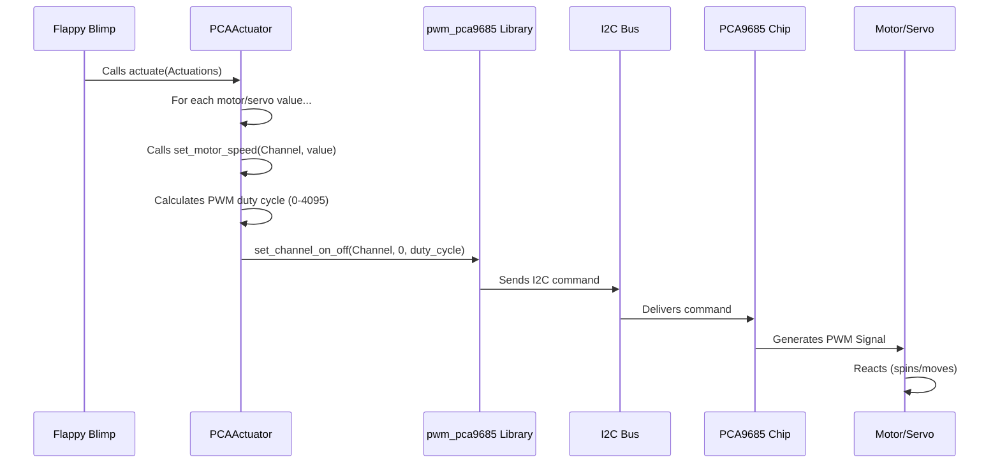

# Chapter 2: Hardware Actuation (`PCAActuator`)

Welcome back! In [Chapter 1: Blimp Control (`Blimp` Trait / `Flappy` Implementation)](01_blimp_control___blimp__trait____flappy__implementation_.md), we saw how the `Flappy` controller acts like the blimp's "brain" or "pilot". It takes commands (from a joystick or an autonomous system) and decides exactly how fast each motor should spin or what angle each servo should be set to. These decisions are packaged into an `Actuations` struct.

But how do those numbers in the `Actuations` struct *actually* make the physical parts of the blimp move? We need a way to translate these software commands into real electrical signals that the motors and servos understand.

That's where the `PCAActuator` comes in! Think of it as the blimp's **nervous system**. It takes the signals from the brain (`Flappy`) and sends them down the "nerves" to the "muscles" (motors and servos), telling them precisely what to do.

## Why Do We Need This?

Computers speak the language of data (like the numbers in `Actuations`), while motors and servos speak the language of electricity – specifically, carefully timed electrical pulses called **PWM (Pulse Width Modulation)**.

Our main computer (like a Raspberry Pi running this software) isn't great at generating *many* of these precise PWM signals simultaneously. So, we use a helper chip called the **PCA9685**. This chip is specifically designed to generate lots of PWM signals.

The `PCAActuator` component in our software acts as the **bridge**:

1.  It receives the desired `Actuations` (motor speeds, servo angles) from `Flappy`.
2.  It communicates with the PCA9685 chip over a connection called **I2C** (a simple way for chips to talk to each other).
3.  It tells the PCA9685 exactly what kind of PWM signal to generate for each motor and servo.
4.  The PCA9685 chip generates these electrical signals, making the hardware move!

## Key Concepts

Let's break down the important ideas:

### 1. The PCA9685 Chip (The Signal Generator)

Imagine you have a translator who can speak many specific dialects. The PCA9685 is like that translator. It sits between the main computer and the motors/servos. The computer gives it high-level instructions (like "set channel 3 to 50% power"), and the PCA9685 translates that into the precise electrical dialect (PWM signal) that the motor or servo on channel 3 understands. It can handle up to 16 different "dialects" (channels) at once!

### 2. PWM Signals (The Electrical Language)

How do you tell a motor how fast to spin using electricity? You could try changing the voltage, but a more common and precise way is using PWM.

Imagine flicking a light switch on and off really, really fast.
*   If you leave it ON for a *short* time and OFF for a *long* time in each cycle, the light looks dim.
*   If you leave it ON for a *long* time and OFF for a *short* time, the light looks bright.

PWM works similarly for motors and servos:
*   **Motors (via ESCs):** A longer "ON" pulse generally means higher speed. A shorter pulse means lower speed. (ESCs, or Electronic Speed Controllers, are little circuits that interpret PWM for brushless motors).
*   **Servos:** The length of the "ON" pulse tells the servo what *angle* to move to. A specific pulse width corresponds to 0 degrees, another to 90 degrees, and another to 180 degrees.

The `PCAActuator` calculates the correct pulse width (the "ON" time) based on the desired speed or angle from the `Actuations` struct.

### 3. Motors vs. Servos

Our blimp uses both:
*   **Motors:** Usually for propulsion (going forward, up/down). They spin continuously. Their speed is controlled by PWM. In our code, these are often `m1`, `m2`, `m3`, `m4`.
*   **Servos:** Used for control surfaces (like fins or vectoring mounts) or flapping mechanisms. They move to and hold a specific angle. Their angle is controlled by PWM. In our code, these are often `s1`, `s2`, `s3`, `s4`.

The `PCAActuator` knows how to generate the right kind of PWM signal for each type.

### 4. ESC Initialization (Waking Up the Motors)

Brushless motors controlled by ESCs often need a special "handshake" sequence when they first power up. This tells the ESC the range of PWM signals it should expect (what means "stop" and what means "full speed"). The `PCAActuator` handles this automatically when it starts up using the `init_escs()` function. It usually involves sending a "full speed" signal, then a "stop" signal, so the ESC learns the limits.

## How `Flappy` Uses `PCAActuator`

Let's revisit how `Flappy` triggers the hardware, now understanding `PCAActuator`'s role.

Remember the `manual()` function in `Flappy`?

```rust
// Simplified from src/lib/blimp.rs (inside Flappy implementation)
pub fn manual(&mut self) {
    // 1. Calculate desired motor/servo settings
    let act: Actuations = self.mix(); // e.g., { m1: 100.0, s1: 45.0, ... }

    // 2. Send these settings to the hardware interface
    self.actuator.actuate(act); // Tell PCAActuator to make it happen!
}
```

1.  `Flappy` calls its `mix()` function to figure out the desired `Actuations` based on joystick input.
2.  It then calls `self.actuator.actuate(act)`, passing the calculated `Actuations` struct to the `PCAActuator`.

The `actuate` function is the main command center for making things move.

## Under the Hood: How `PCAActuator` Works

What happens inside `PCAActuator` when `actuate()` is called?

1.  **Receive Commands:** The `actuate` function gets the `Actuations` struct (e.g., `m1: 100.0, s1: 45.0, ...`).
2.  **Translate Each Command:** For *each* motor (`m1`..`m4`) and servo (`s1`..`s4`) value in the struct:
    *   It calls a helper function like `set_motor_speed()` or `set_servo_speed()`.
    *   These helpers take the target value (e.g., `100.0` for `m1`) and the specific hardware channel it's connected to (e.g., `Channel::C0`).
3.  **Calculate PWM:** Inside the helper functions:
    *   The target value (like an angle from 0-180) is converted into a specific PWM pulse width (usually measured in microseconds, like 1500µs for neutral).
    *   This pulse width is then converted into the numbers (duty cycle, typically 0-4095) that the PCA9685 chip understands.
4.  **Send to Chip:** The `PCAActuator` uses the `pwm_pca9685` library (a specialized tool for talking to the chip) to send these calculated duty cycle numbers to the PCA9685 chip over the I2C communication wire.
5.  **Generate Signal:** The PCA9685 chip receives the command and starts generating the corresponding PWM electrical signal on the specified output pin.
6.  **Move!:** The ESC/motor or servo connected to that pin receives the PWM signal and moves accordingly.

Here's a simplified diagram of the process:



### Code Dive: Inside `PCAActuator`

Let's peek at some key parts of the `src/lib/blimp.rs` file related to `PCAActuator`.

**Creating the Actuator (`PCAActuator::new`)**

```rust
// Simplified from src/lib/blimp.rs
impl PCAActuator {
    pub fn new() -> Self {
        // 1. Setup communication with the PCA9685 chip via I2C
        let dev = I2cdev::new("/dev/i2c-1") // Specify the I2C bus
            .expect("Failed to initialize I2C device");
        let address = Address::default(); // Use default PCA9685 address
        let mut pwm = Pca9685::new(dev, address) // Create the library object
            .expect("Failed to create PCA9685 instance");

        // 2. Configure the PCA9685 chip
        pwm.set_prescale(100) // Set PWM frequency (e.g., ~60Hz)
            .expect("Failed to set prescale");
        pwm.enable() // Turn the chip ON
            .expect("Failed to enable PCA9685");

        // 3. Create the PCAActuator struct
        let mut actuator = PCAActuator { pwm };

        // 4. Initialize the ESCs (important!)
        actuator.init_escs();

        actuator // Return the ready-to-use actuator
    }
    // ... other functions ...
}
```
This function does the initial setup: connecting to the PCA9685 chip over I2C, configuring the PWM signal frequency, enabling the chip, and importantly, running the ESC initialization sequence.

**Initializing the ESCs (`init_escs`)**

```rust
// Simplified from src/lib/blimp.rs
impl PCAActuator {
    pub fn init_escs(&mut self) {
        println!("Initializing ESCs...");

        // Send max throttle (e.g., 180.0 degrees) to all motor channels
        self.set_motor_speed(Channel::C0, 180.0);
        // ... send to C1, C2, C3 ...
        sleep(Duration::from_secs(1)); // Wait

        // Send min throttle (e.g., 0.0 degrees) to arm
        self.set_motor_speed(Channel::C0, 0.0);
        // ... send to C1, C2, C3 ...
        sleep(Duration::from_secs(1)); // Wait

        // Move to neutral (e.g., 90.0 degrees) - ready!
        self.set_motor_speed(Channel::C0, NEUTRAL_ANGLE_MOTOR); // e.g., 90.0
        // ... send to C1, C2, C3 ...
        sleep(Duration::from_secs(2)); // Wait longer

        println!("ESCs initialized!");
    }
    // ... other functions ...
}
```
This function performs the critical startup "handshake" for the ESCs by sending high, low, and then neutral signals. This ensures the motors respond correctly later.

**Setting Motor/Servo Speeds (`set_motor_speed`, `set_servo_speed`)**

```rust
// Simplified from src/lib/blimp.rs
// Constants defining the PWM signal range
const MIN_PULSE: f32 = 600.0; // Pulse width in µs for 0% speed / 0 degrees
const MAX_PULSE: f32 = 2600.0; // Pulse width in µs for 100% speed / 180 degrees
const PWM_FREQUENCY_MOTOR: f32 = 60.0; // How many pulses per second (Hz)

impl PCAActuator {
    fn set_motor_speed(&mut self, channel: Channel, angle: f32) {
        // 1. Map angle (0-180) to pulse width (e.g., 600-2600 µs)
        let pulse_width = MIN_PULSE + (angle / 180.0) * (MAX_PULSE - MIN_PULSE);

        // 2. Calculate the PCA9685 duty cycle (0-4095) based on pulse width and frequency
        let on = 0; // Start the pulse at the beginning of the cycle
        let off = ((pulse_width * PWM_FREQUENCY_MOTOR * 4096.0 * 1e-6) as u16)
                    .clamp(0, 4095); // Ensure value is within 0-4095

        // 3. Send command to the PCA9685 library
        self.pwm.set_channel_on_off(channel, on, off).unwrap();
    }

    // set_servo_speed is very similar, but might use different MIN/MAX_PULSE values
    fn set_servo_speed(&mut self, channel: Channel, angle: f32) {
        // ... calculations similar to set_motor_speed ...
        // ... may use MIN_PULSE_SERVO, MAX_PULSE_SERVO constants ...
        let on = 0;
        let off = /* calculated duty cycle */ ;
        self.pwm.set_channel_on_off(channel, on, off).unwrap();
    }
    // ... other functions ...
}
```
These functions contain the core translation logic. They convert a simple input `angle` (representing speed for motors or position for servos, usually mapped 0-180) into the specific `on` and `off` values (duty cycle) needed by the PCA9685 chip. The `clamp(0, 4095)` ensures we don't send invalid values to the chip.

**Actuating (`actuate`)**

```rust
// Simplified from src/lib/blimp.rs
impl PCAActuator {
    pub fn actuate(&mut self, act: Actuations) {
        // Call set_motor_speed for each motor channel
        self.set_motor_speed(Channel::C0, act.m1); // Motor 1 on Channel 0
        self.set_motor_speed(Channel::C1, act.m2); // Motor 2 on Channel 1
        self.set_motor_speed(Channel::C2, act.m3); // Motor 3 on Channel 2
        self.set_motor_speed(Channel::C3, act.m4); // Motor 4 on Channel 3

        // Call set_servo_speed for each servo channel
        self.set_servo_speed(Channel::C4, act.s1); // Servo 1 on Channel 4
        self.set_servo_speed(Channel::C5, act.s2); // Servo 2 on Channel 5
        self.set_servo_speed(Channel::C6, act.s3); // Servo 3 on Channel 6
        self.set_servo_speed(Channel::C7, act.s4); // Servo 4 on Channel 7
    }
    // ... other functions ...
}
```
This function simply takes the `Actuations` struct and calls the appropriate `set_..._speed` function for each motor and servo value, associating it with the correct hardware channel (C0, C1, C4, etc.) on the PCA9685 board.

## Conclusion

We've now seen how the `PCAActuator` acts as the vital link between the software decisions made by `Flappy` and the physical hardware of the blimp.

*   It uses the **PCA9685 chip** to generate precise **PWM** signals.
*   It translates abstract commands (`Actuations`) into these electrical signals.
*   It handles the necessary **ESC initialization** sequence for the motors.
*   The `actuate()` function is the main way `Flappy` commands the hardware to move.

You now understand how the blimp's "brain" (`Flappy`) talks to its "nervous system" (`PCAActuator`) to control its "muscles" (motors and servos)!

But wait, how does the `PCAActuator` know things like the correct PWM frequency, or the exact pulse widths (MIN_PULSE, MAX_PULSE) for our specific motors and servos? And how does `Flappy` know which joystick axis controls which movement? These details often need to be configured.

In the next chapter, we'll explore how we manage settings and parameters using the configuration system. Let's dive into [Chapter 3: Configuration (`Config`)](03_configuration___config__.md)!


