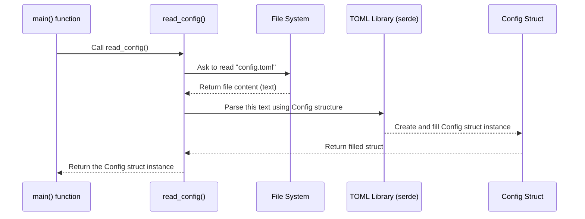

# Chapter 3: Configuration (`Config`)

Welcome back! In [Chapter 2: Hardware Actuation (`PCAActuator`)](02_hardware_actuation___pcaactuator__.md), we learned how the `PCAActuator` takes commands from our software pilot (`Flappy`) and turns them into electrical signals to move the blimp's motors and servos.

But how fast should motor 1 spin compared to motor 2? How aggressively should the blimp try to correct its course when flying autonomously? These are examples of settings or **parameters** that we might want to adjust frequently as we test and improve the blimp.

Imagine tuning a guitar. You don't rebuild the guitar every time you need to adjust the tuning pegs! Similarly, we don't want to rewrite and recompile our entire software project just to make the blimp turn a little faster or slower.

This chapter introduces the **Configuration (`Config`)** system – our way of keeping these adjustable settings separate from the main code, making it easy to tune the blimp's behavior.

## Why Do We Need Configuration?

Think about the settings menu on your phone or computer. You can change the screen brightness, Wi-Fi password, or notification sounds without needing to be a programmer or reinstalling the operating system.

Our blimp needs a similar "settings menu". Here's why:

1.  **Easy Tuning:** We often need to tweak parameters like:
    *   How much power goes to each motor (maybe one motor is slightly stronger than another).
    *   How sensitive the autonomous control is (the PID controller gains we'll see in [Chapter 6: Autonomous Control (`Autonomous`)](06_autonomous_control___autonomous__.md)).
2.  **Adaptability:** Different blimps might use slightly different hardware, or we might fly in different conditions (indoors vs. outdoors). Configuration files let us adapt without changing the core code.
3.  **No Recompiling:** Changing a setting in a configuration file is much faster than changing the code, recompiling everything, and restarting.

**Our Use Case:** Let's say the blimp is flying autonomously, but it's reacting too slowly when it drifts off course. We want to increase its responsiveness by adjusting a setting called `kp_x` (a "Proportional gain" for the controller, which we'll learn more about later). Using the configuration system, we can just change a number in a text file and restart the program!

## Key Concepts

How do we make this "settings menu" work?

### 1. The Settings File (`config.toml`)

We store our settings in a separate text file called `config.toml`. This file uses a simple format called **TOML** (Tom's Obvious, Minimal Language), which is designed to be easy for humans to read.

It uses `key = value` pairs, often grouped into sections using `[section_name]`.

Here's a small example of what `config.toml` might look like:

```toml
# Example config.toml

[server]
host = "0.0.0.0"
port = 8080

[motor]
# Multipliers to adjust power scaling for each motor
m1_mul = 1.0
m2_mul = 1.0
m3_mul = 0.95 # Maybe motor 3 needs slightly less power
m4_mul = 1.0

[controller]
# Gains for the PID controller (used in autonomous mode)
kp_x = 0.8  # Proportional gain for X-axis (sideways)
kp_y = 0.7  # Proportional gain for Y-axis (forward/backward)
kp_z = 1.2  # Proportional gain for Z-axis (up/down)
kd_x = 0.1  # Derivative gain for X-axis
kd_y = 0.1  # Derivative gain for Y-axis
kd_z = 0.2  # Derivative gain for Z-axis
```

You can see settings for the network server, adjustments for individual motors (`m*_mul`), and tuning parameters (`kp_*`, `kd_*`) for the autonomous controller.

### 2. The `Config` Struct in Rust

Okay, we have the settings in a file. How does our Rust code read and understand them? We define a special structure (a `struct`) in our code that exactly mirrors the structure of the `config.toml` file.

```rust
// From src/main.rs

// Automatically generate code to load data into this struct
use serde::Deserialize;

// Top-level structure matching the config file
#[derive(Deserialize, Debug)]
struct Config {
    motor: Motor,         // Matches the [motor] section
    controller: Controller, // Matches the [controller] section
    server: Server,       // Matches the [server] section
}

// Structure for the [motor] section
#[derive(Deserialize, Debug)]
struct Motor {
    m1_mul: f32, // f32 means a decimal number
    m2_mul: f32,
    m3_mul: f32,
    m4_mul: f32,
}

// Structure for the [controller] section
#[derive(Deserialize, Debug)]
struct Controller {
    kp_x: f32,
    kp_y: f32,
    kp_z: f32,
    kd_x: f32,
    kd_y: f32,
    kd_z: f32,
}

// Structure for the [server] section (example)
#[derive(Deserialize, Debug)]
struct Server {
    host: String, // String means text
    port: u16,    // u16 means a whole number (port number)
}
```

*   We define structs (`Config`, `Motor`, `Controller`, `Server`) whose fields match the keys in the `config.toml` file.
*   The magic `#[derive(Deserialize)]` line uses a Rust library called `serde` to automatically generate the code needed to read data from the TOML format and fill in these structs. We don't have to write the parsing code ourselves!
*   `Debug` is added to allow printing the struct easily for debugging.

### 3. Loading the Configuration (`read_config`)

We need a function that actually reads the `config.toml` file from the disk and uses `serde` to "deserialize" it (turn the text into our Rust `Config` struct).

```rust
// Simplified from src/main.rs
use std::fs; // File System access
use toml; // TOML parsing library

fn read_config() -> Config {
    // 1. Read the entire content of "config.toml" into a text string
    let conf_str = fs::read_to_string("config.toml")
        .expect("Failed to read config file"); // Crash if file not found

    // 2. Parse the text string using the TOML library,
    //    filling a 'Config' struct.
    let config: Config = toml::from_str(&conf_str)
        .expect("Failed to parse config file"); // Crash if format is wrong

    // 3. Return the filled 'Config' struct
    config
}
```

This simple function does two main things:
1.  Reads the text content of `config.toml`.
2.  Uses `toml::from_str` (powered by `serde`) to automatically parse that text and create a `Config` object filled with the values from the file.

## How We Use the Configuration

Now let's see how the main program uses this.

1.  **Read at Startup:** When the program starts, the first thing it does is load the configuration.

    ```rust
    // From src/main.rs
    #[tokio::main]
    async fn main() {
        // Load all settings from config.toml into the 'conf' variable
        let conf = read_config();
        println!("Loaded configuration: {:?}", conf); // Print for debugging

        // ... rest of the setup ...
    }
    ```
    The `conf` variable now holds all the settings loaded from the file.

2.  **Pass Settings to Components:** We then use the values stored in `conf` when creating other parts of our system. For example, when setting up the autonomous controller:

    ```rust
    // From src/main.rs (inside main function, after reading conf)
    use lib::autonomous::Autonomous;

    // Create the autonomous controller
    let mut auto = Autonomous::new(
        // Pass the PID gains directly from the loaded config!
        conf.controller.kp_x,
        conf.controller.kp_y,
        conf.controller.kp_z,
        conf.controller.kd_x,
        conf.controller.kd_y,
        conf.controller.kd_z,
        0.0, // Another parameter (perhaps Ki, set to 0 here)
    );

    // Use motor multipliers (Example - actual use might be inside Flappy or PCAActuator)
    // let motor_1_power = raw_motor_power * conf.motor.m1_mul;

    // ... rest of the program loop ...
    ```

    Notice how we access the values using `conf.controller.kp_x`, `conf.motor.m1_mul`, etc. This directly uses the settings loaded from `config.toml`.

**Tuning Example:**

Remember our use case? The blimp reacts too slowly. We think `kp_x` (sideways responsiveness) is too low.

1.  Open `config.toml` in a text editor.
2.  Find the line `kp_x = 0.8` under `[controller]`.
3.  Change it to `kp_x = 1.1` (or some other value).
4.  Save the `config.toml` file.
5.  Stop the blimp software (if it's running).
6.  Restart the blimp software.

Now, when `read_config()` runs, it will load `1.1` into `conf.controller.kp_x`. When the `Autonomous` controller is created, it will receive this new, higher value, making the blimp react more aggressively to sideways movement. We successfully tuned the blimp without touching the main Rust code!

## Under the Hood: The Loading Process

Let's visualize the step-by-step process when `read_config()` is called:



1.  `main()` calls `read_config()`.
2.  `read_config()` asks the operating system's **File System** to read the contents of `config.toml`.
3.  The File System provides the text content.
4.  `read_config()` passes this text to the **TOML Library** (specifically `toml::from_str`, which uses `serde`). It tells the library to try and fit this text into the shape defined by our `Config` struct.
5.  The TOML library parses the text, identifies the `[sections]` and `key = value` pairs, and creates a new **`Config` Struct** instance, filling its fields (`motor`, `controller`, `server`, and their sub-fields) with the corresponding values.
6.  The filled `Config` struct is returned to `read_config()`, which then returns it to `main()`.

The key players are the file system access (`std::fs`) and the TOML parsing library (`toml` powered by `serde`), which handle the translation from a text file to a usable Rust data structure.

## Conclusion

We've learned about the crucial role of the **Configuration (`Config`)** system in `SanoBlimpSoftware`.

*   It allows us to define adjustable **settings** (like motor multipliers and controller gains) in an external file (`config.toml`).
*   This makes it easy to **tune** the blimp's behavior without recompiling the code.
*   We use Rust **structs** (like `Config`, `Motor`, `Controller`) that mirror the `.toml` file structure.
*   The `serde` and `toml` libraries handle the **loading and parsing** of the configuration file into these structs.
*   The main program reads this configuration at **startup** and uses the values to initialize components like the `Autonomous` controller.

Now that we understand how to control the blimp ([Chapter 1](01_blimp_control___blimp__trait____flappy__implementation_.md)), actuate its hardware ([Chapter 2](02_hardware_actuation___pcaactuator__.md)), and configure its parameters ([Chapter 3](03_configuration___config__.md)), how does the blimp actually *see* the world around it, especially when flying autonomously?

In the next chapter, we'll explore how the blimp detects objects using its camera. Let's move on to [Chapter 4: Object Detection (`Detection`)](04_object_detection___detection__.md)!


