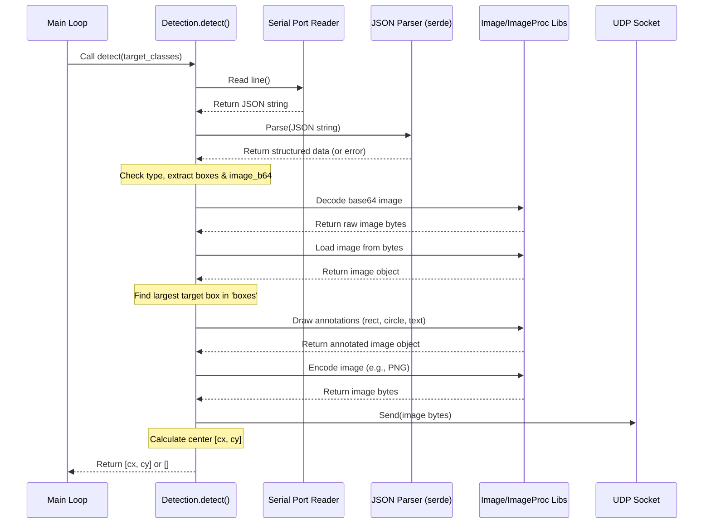

# Chapter 4: Object Detection (`Detection`)

Welcome back! In [Chapter 3: Configuration (`Config`)](03_configuration___config__.md), we saw how to easily adjust settings for our blimp, like motor power or controller sensitivity, using the `config.toml` file. This makes tuning the blimp's behavior much easier.

Now, imagine we want the blimp to do more than just fly around based on joystick commands or simple pre-programmed paths. What if we want it to find and fly towards a specific object, like a landing pad or a target marker? To do that, the blimp needs **eyes**!

This chapter introduces the **`Detection`** module – the part of our software that acts as the blimp's vision system. It takes data from a camera, identifies objects it sees, and figures out where the most important object is located.

**Our Use Case:** Let's say we want the blimp to autonomously find and hover in front of a specific marker (let's say this marker has a class ID of `5`). The `Detection` module will be responsible for looking at the camera feed, finding all objects identified as class `5`, figuring out which one is the biggest (likely the closest), and telling the rest of the system where the center of that marker is in the camera's view.

## Key Concepts

How does the blimp "see"? Let's break it down:

### 1. Camera Input (via Serial Port)

The blimp likely has a small camera connected, maybe to a separate microcontroller (like an ESP32) that's doing the initial heavy lifting of running an object detection model (like YOLO). This microcontroller then sends the results – what it detected and the image itself – over a **serial connection** (like a USB cable) to the main computer running our `SanoBlimpSoftware`. Think of the serial port as a simple one-way communication channel, like a telegraph wire, sending messages from the camera system to our main software.

### 2. JSON Format (The Language of Detection)

How does the camera system package its findings? It sends messages formatted in **JSON** (JavaScript Object Notation). JSON is a very common text-based format that uses key-value pairs, making it easy for different programs (and humans!) to read and understand.

A typical message might look something like this (simplified):

```json
{
  "type": 1,
  "data": {
    "boxes": [
      [100, 50, 30, 30, 95, 5], // [x, y, width, height, confidence, class_id]
      [200, 150, 40, 40, 88, 2]
    ],
    "image": "aGVsbG8gd29ybGQ=..." // Long string of base64 encoded image data
  }
}
```

*   `type`: Identifies the message type (here, `1` might mean "detection results").
*   `data`: Contains the actual information.
*   `boxes`: A list of detected objects. Each object includes its position (`x`, `y`), size (`width`, `height`), confidence score (how sure the model is), and a `class_id` (what kind of object it is, e.g., `5` for our marker, `2` for something else).
*   `image`: The actual image from the camera, encoded into text using **Base64** so it can be sent easily within the JSON message.

Our `Detection` module needs to read this JSON text from the serial port.

### 3. Parsing the Data (Understanding the Message)

Once we receive the JSON text, we need to "parse" it – turn that text into a data structure our Rust code can easily work with. We use a library called `serde_json` to automatically handle this conversion.

### 4. Identifying Objects and Targets

After parsing, we can look inside the `boxes` list. We can iterate through each detected object and check its `class_id`. If we're looking for our marker (class `5`), we'd ignore any objects with a different ID.

### 5. Finding the "Best" Target

Often, the camera might see multiple objects of the same target class. Which one should the blimp focus on? A common strategy is to choose the **largest** one based on its bounding box area (width * height). The assumption is that the largest object is likely the closest or most relevant one. Our `Detection` module includes logic (`get_largest` function) to find the bounding box with the biggest area among the target classes we care about.

### 6. Annotating the Image (Drawing on the Picture)

For debugging and visualization, it's helpful to *see* what the detection module is doing. The `Detection` module takes the original image (decoded from Base64), draws the bounding box of the chosen target object on it, maybe adds a circle at its center, and includes a label with the class ID and confidence score. This creates a new, annotated image.

### 7. Streaming the Annotated Image (via UDP)

Finally, how do we see this annotated image? The `Detection` module sends the processed image data over the network using **UDP** (User Datagram Protocol). UDP is a fast way to send data, suitable for streaming video frames. A separate program running on another computer on the network can listen for these UDP packets and display the live, annotated video feed, showing us what the blimp sees and detects.

## How We Use `Detection`

Let's look at how the main program (`src/main.rs`) uses the `Detection` module to achieve our goal: finding the marker (class `5`).

1.  **Create the Detector:**
    First, we create an instance of the `Detection` struct. This automatically sets up the serial port connection and the UDP socket for sending images.

    ```rust
    // From src/main.rs
    use lib::object_detection::Detection;

    // Create a new Detection instance
    let mut detection = Detection::new();
    ```
    This prepares the `detection` object to start receiving and processing data.

2.  **Call `detect` in the Loop:**
    Inside the main program loop, we continuously ask the `detection` module to look for our target.

    ```rust
    // Simplified loop from src/main.rs
    loop {
        // ... (update blimp state) ...

        // Define which object classes we are interested in
        let target_classes = vec![5]; // We only care about class ID 5

        // Ask the detection module to process the next camera frame
        // and find the largest object matching target_classes.
        let det_result = detection.detect(target_classes);
        // det_result might be: [120, 80] (center coordinates cx, cy)
        // or: [] (if no target class 5 was found)

        if blimp.is_manual() {
            // ... (handle manual control) ...
        } else {
            // Autonomous Mode
            if !det_result.is_empty() {
                // We found our target!
                let cx = det_result[0] as f32; // Center X coordinate
                let cy = det_result[1] as f32; // Center Y coordinate

                // Use cx, cy to calculate blimp movement commands
                // (We'll cover this in Chapter 6: Autonomous Control)
                let auto_input = auto.position(-1.0, cx, cy); // Example call

                // Send commands to the blimp
                blimp.update_input(auto_input);
                let actuations = blimp.mix();
                blimp.actuator.actuate(actuations);
            } else {
                // No target found, maybe search?
                println!("Searching for target...");
                // ... (handle searching behavior) ...
            }
        }
        // ... (small delay) ...
    }
    ```
    *   We define `target_classes` as a list containing just `5`.
    *   We call `detection.detect(target_classes)`. This function does all the work: reads serial, parses JSON, finds the largest object with class ID 5, annotates the image, sends it via UDP, and *returns* the center coordinates `[cx, cy]` of the detected object.
    *   If `det_result` is not empty, it means our target marker was found. We extract the `cx` and `cy` coordinates.
    *   These coordinates are then passed to the `Autonomous` controller (covered in [Chapter 6: Autonomous Control (`Autonomous`)](06_autonomous_control___autonomous__.md)) which figures out how the blimp should move to center the target in its view.
    *   If `det_result` *is* empty, the target wasn't found in this frame, so the blimp might enter a "searching" state.

## Under the Hood: How `detect()` Works

What actually happens step-by-step when `detection.detect()` is called?

1.  **Read Serial:** It waits to receive a complete line of text (ending in a newline character) from the serial port connection established in `Detection::new()`.
2.  **Parse JSON:** It takes the received text line and uses `serde_json` to try and turn it into a structured Rust object that mirrors the expected JSON format (with `type`, `data`, `boxes`, `image`). If parsing fails (e.g., malformed JSON), it stops and returns empty.
3.  **Check Type:** It checks if the `type` field in the JSON is `1`. If not, it ignores this message and returns empty.
4.  **Extract Data:** It gets the `boxes` array and the base64-encoded `image` string from the `data` field. If either is missing or has the wrong format, it stops and returns empty.
5.  **Decode Image:** It decodes the base64 `image` string back into raw image bytes.
6.  **Load Image:** It uses the `image` library to load these raw bytes into an image object that Rust can manipulate.
7.  **Find Largest Target:** It calls the internal `get_largest` function, passing it the `boxes` array and the `target_classes` provided by the user (e.g., `vec![5]`). `get_largest` loops through the boxes, checks if the class ID matches any in `target_classes`, calculates the area (w\*h), and keeps track of the box with the largest area found so far. It returns the details (`[x, y, w, h, conf, cls]`) of that largest matching box.
8.  **Annotate Image:** If `get_largest` found a target, the `detect` function uses the `imageproc` library to:
    *   Draw a rectangle around the bounding box (`[x, y, w, h]`).
    *   Draw a circle at the center (`cx = x + w/2`, `cy = y + h/2`).
    *   Add text labels (like class ID and confidence).
9.  **Encode Image:** The annotated image (now possibly with drawings on it) is encoded into a standard image format like PNG. This turns the image object back into a sequence of bytes.
10. **Send UDP:** These image bytes are sent as a single packet over the UDP socket (created in `Detection::new()`) to a predefined network address and port. A separate viewer application can listen here to display the stream.
11. **Return Coordinates:** If a target was found, the function calculates the center coordinates `cx` and `cy` and returns them as a `Vec<i32>` (e.g., `vec![120, 80]`). If no target was found at any step, it returns an empty `Vec<i32>` (`vec![]`).

Here’s a diagram showing the flow:



## Code Dive: Inside `object_detection.rs`

Let's peek at some key code snippets from `src/lib/object_detection.rs`.

**Setting up (`Detection::new`)**

```rust
// Simplified from src/lib/object_detection.rs
use std::io::{BufRead, BufReader};
use std::net::UdpSocket;
use serialport::SerialPort; // For serial communication
use std::time::Duration;

pub struct Detection {
    reader: BufReader<Box<dyn SerialPort>>, // Reads from serial
    udp_socket: UdpSocket, // Sends images via UDP
}

impl Detection {
    pub fn new() -> Self {
        // Configure and open the serial port
        let port_name = /* "/dev/ttyACM0" or "COM1" */;
        let baud_rate = 921600; // High speed for images
        let serial_port = serialport::new(port_name, baud_rate)
            .timeout(Duration::from_secs(1)) // Wait up to 1 sec for data
            .open()
            .expect("Failed to open the serial port");

        // Create a buffered reader for efficient line reading
        let reader = BufReader::new(serial_port);

        // Create a UDP socket bound to any local port (0 means OS chooses)
        let udp_socket = UdpSocket::bind("0.0.0.0:0")
            .expect("Failed to bind local UDP socket");

        Detection { reader, udp_socket }
    }
    // ... detect() and get_largest() methods ...
}
```
This `new` function handles the one-time setup: opening the specified serial port with the correct settings and creating the UDP socket that will be used later to send out annotated images.

**Finding the Largest Target (`get_largest`)**

```rust
// Simplified from src/lib/object_detection.rs
use serde_json::Value; // Represents parsed JSON data

impl Detection {
    // boxes: List of detected objects from JSON [x, y, w, h, conf, cls]
    // target: List of class IDs we care about (e.g., [5])
    fn get_largest(&self, boxes: &[Value], target: &[i32]) -> Vec<i32> {
        let mut largest_area = 0;
        let mut largest_bb = Vec::new(); // Store the best [x,y,w,h,conf,cls]

        for b in boxes {
            if let Some(arr) = b.as_array() { // Check if it's a list
                if arr.len() < 6 { continue; } // Need at least 6 values

                // Extract values (simplified error handling)
                let w = arr[2].as_i64().unwrap_or(0) as i32;
                let h = arr[3].as_i64().unwrap_or(0) as i32;
                let cls = arr[5].as_i64().unwrap_or(0) as i32;

                // Is this class one of our targets?
                if target.contains(&cls) {
                    let area = w * h;
                    // Is this area the biggest one we've seen so far?
                    if area > largest_area {
                        largest_area = area;
                        // Store all details of this new largest box
                        largest_bb = arr.iter()
                                       .map(|v| v.as_i64().unwrap_or(0) as i32)
                                       .collect();
                    }
                }
            }
        }
        largest_bb // Return the details of the largest target found (or empty)
    }
    // ... new() and detect() methods ...
}
```
This helper function iterates through the detected boxes, checks if their class ID is in our desired `target` list, calculates the area, and returns the full details of the matching box with the largest area.

**The Main `detect` Method (Simplified Flow)**

```rust
// Simplified flow within src/lib/object_detection.rs detect() method
pub fn detect(&mut self, target: Vec<i32>) -> Vec<i32> {
    // 1. Read a line from serial
    let mut line = String::new();
    if self.reader.read_line(&mut line).is_err() { return vec![]; }

    // 2. Parse JSON
    let json_val: Value = match serde_json::from_str(line.trim()) {
        Ok(val) => val,
        Err(_) => return vec![], // Parsing failed
    };

    // 3. Check type and extract data (simplified)
    if json_val["type"].as_i64() != Some(1) { return vec![]; }
    let boxes = json_val["data"]["boxes"].as_array().unwrap_or_default();
    let image_b64 = json_val["data"]["image"].as_str().unwrap_or("");

    // 4. Decode and Load Image (simplified)
    let image_bytes = match base64::decode(image_b64) {/* ... */}
    let dyn_img = match image::load_from_memory(&image_bytes) {/* ... */}

    // 5. Find Largest Target
    let arr = self.get_largest(boxes, &target);
    if arr.is_empty() {
        // No target found - send raw image via UDP (optional) & return []
        // ... (code to send dyn_img via UDP) ...
        return vec![];
    }

    // Target found! Extract details.
    let x = arr[0]; let y = arr[1]; let w = arr[2]; let h = arr[3];
    let cx = x + w / 2; let cy = y + h / 2;

    // 6. Annotate Image (simplified)
    let mut rgba_img = dyn_img.to_rgba8();
    // ... draw_hollow_rect_mut(&mut rgba_img, ...) ...
    // ... draw_filled_circle_mut(&mut rgba_img, (cx, cy), ...) ...
    // ... draw_text_mut(&mut rgba_img, ...) ...

    // 7. Encode and Send Annotated Image via UDP (simplified)
    let mut img_buf = Vec::new();
    // ... encode rgba_img to PNG into img_buf ...
    let udp_dest = "192.168.8.194:54321"; // Destination address
    self.udp_socket.send_to(&img_buf, udp_dest).ok(); // Send UDP packet

    // 8. Return Center Coordinates
    vec![cx, cy]
}
```
This shows the main steps within the `detect` function: reading, parsing, finding the target using `get_largest`, annotating the image if found, sending the (potentially annotated) image via UDP, and finally returning the center coordinates `[cx, cy]` or an empty vector.

## Conclusion

Fantastic! You've now learned how the `SanoBlimpSoftware` gets its "vision" using the **`Detection`** module.

*   It receives object detection results (bounding boxes, class IDs) and camera images via **serial** communication, formatted as **JSON**.
*   It **parses** this JSON data to understand what the camera system detected.
*   It can identify specific **target objects** based on their class ID.
*   It finds the **largest** relevant target object, assuming it's the most important one.
*   It **annotates** the camera image by drawing boxes and labels for visualization.
*   It **streams** the annotated image over the network using **UDP**.
*   The `detect()` method provides the **center coordinates (`cx`, `cy`)** of the primary target, which is crucial information for autonomous navigation.

We now have the blimp's controls ([Chapter 1](01_blimp_control___blimp__trait____flappy__implementation_.md)), its muscle control ([Chapter 2](02_hardware_actuation___pcaactuator__.md)), its settings ([Chapter 3](03_configuration___config__.md)), and its vision ([Chapter 4](04_object_detection___detection__.md)).

What other information might the blimp need to fly effectively, especially on its own? It probably needs more than just camera vision. Think about sensors like height sensors (altimeters) or orientation sensors (IMUs).

In the next chapter, we'll conceptually discuss how sensor inputs might be integrated to give the blimp a better understanding of its own state in the world. Let's move on to [Chapter 5: Sensor Input/State (Conceptual)](05_sensor_input_state__conceptual_.md)!


