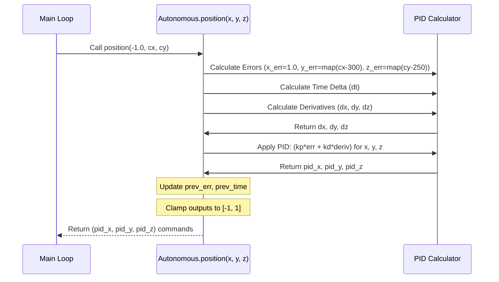

# Chapter 6: Autonomous Control (`Autonomous`)

Welcome! In [Chapter 5: Sensor Input/State (Conceptual)](05_sensor_input_state__conceptual_.md), we explored how the blimp uses sensors like IMUs and pressure sensors to understand its own orientation and altitude. Combined with the "eyes" from [Chapter 4: Object Detection (`Detection`)](04_object_detection___detection__.md) that let it see targets, the blimp now has a good sense of both itself and its surroundings.

But how does it *use* all this information to fly on its own? How does it decide to turn left when the target is off to the left, or fly forward to get closer? We need an **autopilot**!

This chapter introduces the **`Autonomous`** module. Think of it as the **pilot's brain** when the blimp is flying itself. It takes information about the target's position (from `Detection`) and potentially the blimp's own state (like altitude, though the current implementation focuses mainly on visual target tracking), and calculates the precise steering and throttle commands needed to reach the goal.

**Our Use Case:** We want the blimp to automatically find a marker (class ID 5, detected by `Detection`) and fly towards it, trying to keep the marker centered in its camera view. The `Autonomous` module will continuously calculate how much to turn, fly forward/backward, and move up/down to achieve this.

## Key Concepts

Let's break down how this software autopilot works:

### 1. The Goal: Stay on Target

The main job of the `Autonomous` module in our current setup is to keep a visually detected object centered in the camera's view. It might also aim to maintain a specific altitude, although we'll focus on the visual centering first.

### 2. Measuring the "Error": How Far Are We Off?

The first step is figuring out how far the blimp is from its desired state. This difference is called the **error**.

*   **Position Error:** The `Detection` module gives us the center coordinates (`cx`, `cy`) of the target object in the camera image (e.g., `cx=400`, `cy=200`). Our goal might be to have the target perfectly centered (e.g., at `cx=300`, `cy=250` if the camera resolution is 600x500). The `Autonomous` module calculates the difference:
    *   Horizontal Error (`y_err` in the code): How far left/right the target is from the center (`400 - 300 = 100 pixels to the right`).
    *   Vertical Error (`z_err` in the code): How far up/down the target is from the center (`200 - 250 = -50 pixels, meaning 50 pixels too high`).
*   **Altitude Error (Conceptual):** If we also wanted to maintain a height of 2 meters, and the sensor from Chapter 5 reported we are at 1.8 meters, the altitude error would be `1.8 - 2.0 = -0.2 meters` (too low).

The `Autonomous` module needs these error values to know what corrections are needed.

### 3. The PID Controller: Smart Corrections

Okay, we know we're 100 pixels off to the right. How much should we tell the blimp to turn left? Just turning hard left might overshoot the target. Not turning enough will be too slow. We need a smart way to decide the *amount* of correction.

This is where a **PID controller** comes in. PID stands for Proportional-Integral-Derivative. It's a widely used control method that calculates an output command based on the error, trying to minimize it efficiently and stably. Think of it like sophisticated cruise control for position:

*   **P (Proportional):** This part reacts based on the *current* error. The bigger the error, the bigger the correction. If the target is far to the right (`y_err` is large), the Proportional term says "turn left significantly". If it's only slightly off, it says "turn left gently". It's like pressing the gas pedal harder the further you are below your target speed.
*   **I (Integral):** This part looks at the *sum of past errors*. If, despite corrections, the blimp is *consistently* a little bit off to the right over time, the Integral term will gradually increase the "turn left" command to eliminate this steady drift. (Note: The `ki` gain for this is present in our `Autonomous` struct but set to 0.0 in `main.rs`, so the Integral part isn't active in the current configuration, simplifying things.)
*   **D (Derivative):** This part looks at how *fast* the error is *changing*. If the target is rapidly moving towards the center (error is decreasing quickly), the Derivative term might reduce the "turn left" command slightly to prevent overshooting. It acts like a damper, smoothing out the corrections and preventing jerky oscillations. It's like easing off the gas slightly as you approach your target speed quickly.

By combining these three components (or just P and D in our case), the PID controller calculates a balanced output command.

### 4. Output: Movement Commands

Based on the calculated errors (`y_err` for horizontal, `z_err` for vertical, and a term related to forward motion `x_err`), the PID controller in `Autonomous` computes three output values (`pid_x`, `pid_y`, `pid_z`). These represent the desired adjustments:

*   `pid_x`: Controls **forward/backward** movement (likely based on a constant error term, telling the blimp to generally move forward towards the target).
*   `pid_y`: Controls **turning left/right** (based on the horizontal error `y_err`).
*   `pid_z`: Controls **moving up/down** (based on the vertical error `z_err`).

These three values are typically numbers between -1.0 and 1.0, representing the intensity and direction of the desired movement.

## How We Use `Autonomous`

Let's see how the `main.rs` program uses the `Autonomous` controller.

1.  **Create the Controller:**
    First, we create an instance of `Autonomous`, providing the PID gains loaded from our [Configuration (`Config`)](03_configuration___config__.md). These gains (`kp_x`, `kd_y`, etc.) tune how aggressively the P and D terms react.

    ```rust
    // From src/main.rs
    use lib::autonomous::Autonomous;
    // ... load conf = read_config(); ...

    let mut auto = Autonomous::new(
        // Pass the PID gains from the loaded config
        conf.controller.kp_x, // Proportional gain for X (Forward/Backward)
        conf.controller.kp_y, // Proportional gain for Y (Turning)
        conf.controller.kp_z, // Proportional gain for Z (Up/Down)
        conf.controller.kd_x, // Derivative gain for X
        conf.controller.kd_y, // Derivative gain for Y
        conf.controller.kd_z, // Derivative gain for Z
        0.0,                  // Integral gain (set to 0)
    );
    ```
    This creates the `auto` object, ready to calculate commands using the tuning parameters from `config.toml`.

2.  **Using it in the Loop:**
    Inside the main loop, when the blimp is *not* in manual mode:

    ```rust
    // Simplified loop from src/main.rs
    loop {
        blimp.update(); // Check joystick (for mode switching)
        // Get detection results: [cx, cy] or []
        let det = detection.detect(vec![/* target classes */]);

        if blimp.is_manual() {
            // Manual Control
            blimp.manual();
        } else {
            // Autonomous Mode
            if det.len() > 1 { // Check if a target was detected
                let cx = det[0] as f32; // Target horizontal center
                let cy = det[1] as f32; // Target vertical center

                // Calculate desired movement using PID based on target pos
                // Input: x (fixed -1.0), y (cx), z (cy)
                // Output: (forward, turn, up/down) commands [-1.0, 1.0]
                let auto_input = auto.position(-1.0, cx, cy);
                println!("Autonomous commands: {:?}", auto_input); // e.g., (0.5, -0.2, 0.1)

                // Send these commands to the blimp controller
                blimp.update_input(auto_input);

                // Tell the blimp to mix and actuate based on these commands
                let actuations = blimp.mix();
                blimp.actuator.actuate(actuations);

            } else {
                // No target detected - maybe stop or search
                println!("Searching for target...");
                blimp.update_input((0.0, 0.0, 0.0)); // Command: Stop
                let acc = blimp.mix();
                blimp.actuator.actuate(acc); // Apply the stop command
                // (Could add searching movements here)
            }
        }
        // (Small delay usually happens here)
    }
    ```
    *   It calls `detection.detect()` to get the target's center coordinates (`cx`, `cy`).
    *   If a target is found (`det.len() > 1`), it calls `auto.position(-1.0, cx, cy)`.
        *   The `-1.0` seems to be a fixed input related to the forward motion calculation.
        *   `cx` and `cy` provide the current position error inputs.
    *   `auto.position` performs the PID calculation and returns the desired movement commands `(pid_x, pid_y, pid_z)` as `auto_input`. For example, `(0.5, -0.2, 0.1)` might mean "fly forward moderately", "turn left slightly", and "move up slightly".
    *   These commands are fed into the `Flappy` controller using `blimp.update_input()`.
    *   `blimp.mix()` translates these abstract commands into specific motor/servo settings (`Actuations`).
    *   `blimp.actuator.actuate()` sends the signals to the hardware, making the blimp move.
    *   If no target is detected, it commands the blimp to stop (`update_input((0.0, 0.0, 0.0))`).

This loop continuously uses the `Autonomous` brain to steer the blimp towards the detected target.

## Under the Hood: How `Autonomous::position` Works

Let's trace the steps inside the `auto.position(x, y, z)` function when it's called with the target coordinates (`x=-1.0`, `y=cx`, `z=cy`):

1.  **Calculate Errors:**
    *   It calculates the difference between the current target position (`y=cx`, `z=cy`) and the desired setpoint (e.g., center of the screen, hardcoded as `300` for horizontal and `250` for vertical in the code).
    *   `y_err = map(cx - 300, ...)`: Horizontal error, mapped to `[-1.0, 1.0]`.
    *   `z_err = map(cy - 250, ...)`: Vertical error, mapped to `[-1.0, 1.0]`.
    *   `x_err = 0.0 - x = 0.0 - (-1.0) = 1.0`: Error related to forward motion (constant in this setup).
2.  **Calculate Time Delta (`dt`):** It measures the time elapsed since the `position` function was last called. This is needed for the Derivative calculation.
3.  **Calculate Derivatives:** It calculates how fast each error is changing:
    *   `dx = (x_err - prev_x) / dt` (This will be 0 after the first call, since `x_err` is constant).
    *   `dy = (y_err - prev_y) / dt`.
    *   `dz = (z_err - prev_z) / dt`.
4.  **Calculate PID Output:** It applies the PID formula (using only P and D terms here) for each axis:
    *   `pid_x = (kp_x * x_err) + (kd_x * dx)` (Controls Forward/Backward)
    *   `pid_y = (kp_y * y_err) + (kd_y * dy)` (Controls Turning)
    *   `pid_z = (kp_z * z_err) + (kd_z * dz)` (Controls Up/Down)
5.  **Update State:** It stores the current errors (`x_err`, `y_err`, `z_err`) and the current time (`now`) to be used as the "previous" values in the next calculation.
6.  **Clamp Output:** It ensures each output command (`pid_x`, `pid_y`, `pid_z`) stays within the valid range of `[-1.0, 1.0]`.
7.  **Return Commands:** It returns the calculated `(pid_x, pid_y, pid_z)` tuple.

Here’s a simplified diagram of this flow:



## Code Dive: Inside `src/lib/autonomous.rs`

Let's look at the key parts of the `Autonomous` implementation.

**The `Autonomous` Struct:**

```rust
// From src/lib/autonomous.rs
use std::time::{Duration, Instant};

#[derive(Debug)]
pub struct Autonomous {
    // Previous error values for Derivative calculation
    prev_x: f32,
    prev_y: f32,
    prev_z: f32,

    // Timestamp of the last call to position()
    prev_detection: Option<Instant>,

    // PID gains (loaded from config)
    kp_x: f32, // Proportional gain for Forward/Backward
    kd_x: f32, // Derivative gain for Forward/Backward
    kp_y: f32, // Proportional gain for Turning
    kd_y: f32, // Derivative gain for Turning
    kp_z: f32, // Proportional gain for Up/Down
    kd_z: f32, // Derivative gain for Up/Down
    ki: f32,   // Integral gain (unused if 0)

    // Altitude control related (less used in main loop example)
    ground_altitude: Option<f32>,
}
```
This struct holds the state needed for PID calculations: the previous errors, the time of the last update, and the crucial PID gains (`kp_`, `kd_`, `ki`) that determine the controller's behavior.

**Creating the Controller (`new`):**

```rust
// From src/lib/autonomous.rs
impl Autonomous {
    // Creates a new Autonomous controller instance.
    pub fn new(kp_x: f32, kp_y: f32, kp_z: f32, kd_x: f32, kd_y: f32, kd_z: f32, ki: f32) -> Self {
        Self {
            prev_x: 0.0, // Initialize previous errors to 0
            prev_y: 0.0,
            prev_z: 0.0,
            prev_detection: None, // No previous detection time yet

            // Store the gains passed in
            kp_x, kd_x,
            kp_y, kd_y,
            kp_z, kd_z,
            ki,

            ground_altitude: None,
        }
    }
    // ... other methods ...
}
```
The `new` function simply takes the PID gains (likely from the config file) and initializes the state variables.

**Calculating Position Commands (`position`):**

```rust
// Simplified from src/lib/autonomous.rs
impl Autonomous {
    // Calculates PID control outputs based on target position (x,y,z)
    // y = cx (horizontal pixels), z = cy (vertical pixels)
    // Output: (forward, turn, up/down) commands [-1.0, 1.0]
    pub fn position(&mut self, x: f32, y: f32, z: f32) -> (f32, f32, f32) {
        // 1. Calculate Errors relative to setpoint (e.g., 300, 250)
        //    and map them to the range [-1.0, 1.0]
        let x_err = 0.0 - x; // Constant 1.0 if x = -1.0
        let y_err = self.map_value(y - 300.0, -300.0, 300.0, -1.0, 1.0); // Horizontal err
        let z_err = self.map_value(z - 250.0, 250.0, -250.0, 1.0, -1.0); // Vertical err (note inverted mapping)

        // 2. Calculate Time Delta (dt)
        let now = Instant::now();
        let dt = if let Some(prev) = self.prev_detection {
            now.duration_since(prev).as_secs_f32().max(1e-6) // Avoid div by zero
        } else {
            1e-6 // Default dt for the first run
        };

        // 3. Calculate Derivatives
        let dx = (x_err - self.prev_x) / dt;
        let dy = (y_err - self.prev_y) / dt;
        let dz = (z_err - self.prev_z) / dt;

        // 4. Calculate PID Output (P + D terms only, as ki=0 typically)
        // Note: kp_x/kd_x affect forward, kp_y/kd_y affect turning, kp_z/kd_z affect up/down
        let pid_x = (self.kp_x * x_err) + (self.kd_x * dx); // Forward command
        let pid_y = (self.kp_y * y_err) + (self.kd_y * dy); // Turning command
        let pid_z = (self.kp_z * z_err) + (self.kd_z * dz); // Up/Down command

        // 5. Update State for next iteration
        self.prev_x = x_err;
        self.prev_y = y_err;
        self.prev_z = z_err;
        self.prev_detection = Some(now);

        // 6. Clamp Output to [-1.0, 1.0]
        let px = pid_x.clamp(-1.0, 1.0);
        let py = pid_y.clamp(-1.0, 1.0);
        let pz = pid_z.clamp(-1.0, 1.0);

        // 7. Return Commands
        (px, py, pz) // (forward, turn, up/down)
    }

    // Helper to map a value from one range to another
    pub fn map_value(&self, value: f32, from_low: f32, from_high: f32, to_low: f32, to_high: f32) -> f32 {
        (value - from_low) / (from_high - from_low) * (to_high - to_low) + to_low
    }
    // ... altitude methods (set_ground, goal_height) ...
}
```
This function implements the core PID logic described earlier. It calculates errors, derivatives, applies the PID formula using the configured gains, and returns clamped output commands ready to be sent to the blimp's control system ([Chapter 1: Blimp Control (`Blimp` Trait / `Flappy` Implementation)](01_blimp_control___blimp__trait____flappy__implementation_.md)). The `map_value` helper is used to scale the raw pixel errors into the standard `[-1.0, 1.0]` range expected by the PID calculations.

## Conclusion

Great job! You've now learned about the **`Autonomous`** module, the autopilot brain of the `SanoBlimpSoftware`.

*   It acts as an **autopilot**, calculating movement commands to achieve goals like centering a visual target.
*   It relies on measuring the **error** (how far the blimp is from its target state).
*   It uses a **PID controller** (Proportional-Integral-Derivative) to smartly calculate corrections based on the error and how it's changing.
*   The PID **gains** (`kp`, `ki`, `kd`) are crucial tuning parameters, often set via the [Configuration (`Config`)](03_configuration___config__.md).
*   The `position` function takes target coordinates (from [Chapter 4: Object Detection (`Detection`)](04_object_detection___detection__.md)) and calculates **forward/backward, turn, and up/down** commands.
*   These commands are then fed into the main blimp control system ([Chapter 1](01_blimp_control___blimp__trait____flappy__implementation_.md)) and sent to the hardware ([Chapter 2: Hardware Actuation (`PCAActuator`)](02_hardware_actuation___pcaactuator__.md)).

We've covered almost the entire software pipeline, from control and actuation to configuration, vision, sensors, and autonomous logic. There's one more piece: how do we actually *see* the annotated video feed that the `Detection` module creates?

In the final chapter, we'll look at the system components responsible for processing the camera image and streaming it over the network. Let's move on to [Chapter 7: Image Processing & Streaming](07_image_processing___streaming.md)!


