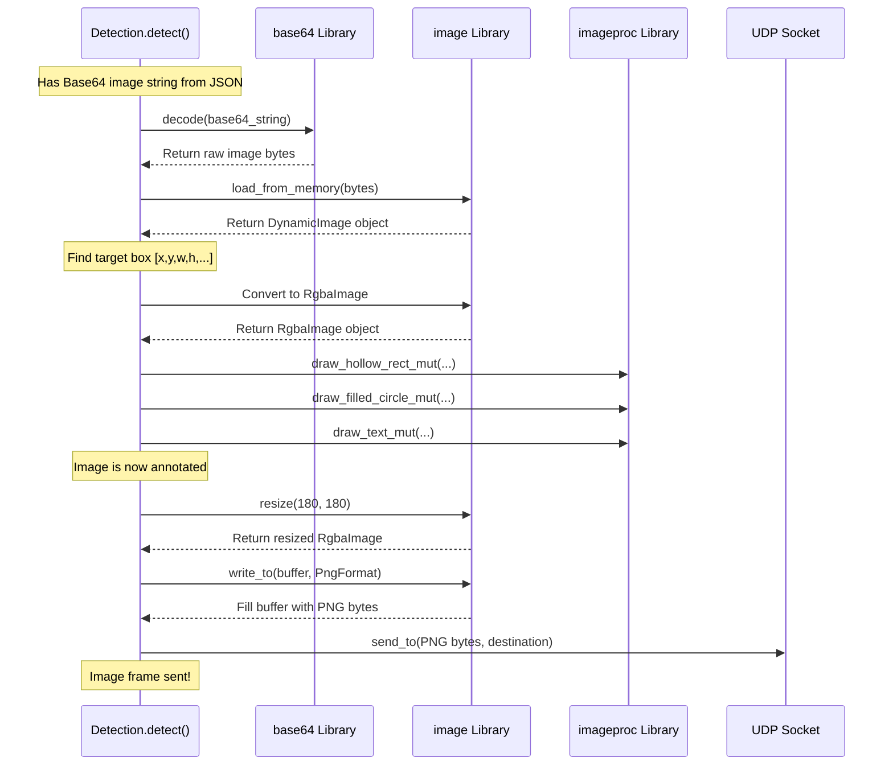

# Chapter 7: Image Processing & Streaming

Welcome back! In [Chapter 6: Autonomous Control (`Autonomous`)](06_autonomous_control___autonomous__.md), we saw how the blimp uses its "brain" – the `Autonomous` module with its PID controller – to decide how to fly towards a target based on information from its sensors and vision system. We know the `Detection` module finds the target's coordinates (`cx`, `cy`).

But wouldn't it be great if we could *see* what the blimp is seeing while it flies? Can we get a live video feed, maybe even with the detected objects highlighted, so we know what the blimp is focusing on?

This chapter covers **Image Processing & Streaming**. This capability, mostly happening inside the [Object Detection (`Detection`)](04_object_detection___detection__.md) module, is like setting up a live video call from the blimp back to our control station (our laptop). It takes the raw picture from the camera, draws helpful information on it, and sends it over the network.

**Our Use Case:** We want to watch the blimp fly autonomously from our laptop. We need a live video stream showing the blimp's camera view. Crucially, we want to see boxes drawn around the objects the blimp detects, and maybe a red circle around the specific target it's currently flying towards, just to confirm it's working correctly.

## Key Concepts

Let's break down how the blimp becomes a video streamer:

### 1. Getting the Picture: Decoding Base64

Remember in [Chapter 4: Object Detection (`Detection`)](04_object_detection___detection__.md), the camera system sends its findings as JSON messages? Inside that JSON, the actual image data is encoded as a long string of text using **Base64**. Think of Base64 as a way to disguise picture data as plain text so it can travel easily inside the JSON message.

The first step is to **decode** this Base64 string back into its original form: raw image bytes, the actual data representing the picture.

### 2. Understanding the Picture: Loading into Memory

Once we have the raw image bytes, the computer needs to understand it as a picture. We use a Rust library called `image` to load these bytes and turn them into an image object in the computer's memory. This object represents the picture as a grid of pixels, where each pixel has a color.

### 3. Drawing on the Picture: Annotation

This is where we add helpful visuals! If the `Detection` module found our target marker, we want to highlight it. We use another Rust library called `imageproc` (image processing) which provides tools like virtual pens and shape tools. We can:
*   Draw a rectangle (bounding box) around detected objects.
*   Draw a filled circle at the center of the main target.
*   Write text labels (like the object's class ID or confidence score) directly onto the image.

This process is called **annotation**. We're adding notes and drawings to the original picture.

### 4. Preparing for Sending: Resizing and Encoding

Raw, high-resolution images can be quite large, making them slow to send over a network. To speed things up, we often **resize** the annotated image to make it smaller (e.g., 180x180 pixels). This reduces the amount of data we need to send.

After resizing, we need to convert the image object (which is now stored in the computer's memory in a specific way) back into a standard format that can be easily sent and displayed. We **encode** it, often into a format like **PNG**. Encoding is like saving the picture to a file, but instead of saving to disk, we save the resulting bytes into a temporary storage area (a buffer) in memory.

### 5. Sending the Picture: UDP Streaming

Now we have the final, annotated, resized, and PNG-encoded image bytes ready to go. How do we send them? We use **UDP (User Datagram Protocol)**.

Think of UDP like sending postcards:
*   It's fast because you just write the address and drop it in the mailbox. You don't wait for confirmation that it arrived.
*   Sometimes, a postcard might get lost or arrive out of order, but for live video, losing an occasional frame isn't usually a disaster. We prioritize speed over guaranteed delivery.

Our `Detection` module uses a **UDP socket** (like a dedicated mailbox) to send these image bytes as a packet over the network to a specific address and port (e.g., `192.168.8.194:54321`), where our laptop can be listening to receive and display them.

## How We Use Image Streaming

The good news is, you don't need to call a separate function just for streaming! This image processing and streaming happens automatically *inside* the `Detection::detect` method we already learned about in [Chapter 4: Object Detection (`Detection`)](04_object_detection___detection__.md).

```rust
// Remember this from Chapter 4 / Chapter 6?
// Simplified loop from src/main.rs
loop {
    // ... (other logic) ...

    if !blimp.is_manual() {
        // Autonomous Mode
        // Calling detect() finds the target AND streams the image!
        let det_result = detection.detect(target_classes);

        if !det_result.is_empty() {
            // Use cx, cy for autonomous control...
            let cx = det_result[0] as f32;
            let cy = det_result[1] as f32;
            let auto_input = auto.position(-1.0, cx, cy);
            blimp.update_input(auto_input);
            // ... (mix and actuate) ...
        } else {
            // Target not found...
        }
    }
    // ... (delay) ...
}
```
Every time the loop calls `detection.detect(...)` in autonomous mode:
1.  It reads the serial port for JSON data.
2.  It processes the image (decode, annotate, resize, encode).
3.  It **sends the processed image via UDP** to the configured destination.
4.  It returns the target coordinates `[cx, cy]` (or an empty vector).

So, just by running the normal autonomous loop, the annotated video stream is automatically being sent out! You just need another program on your laptop (listening at the correct UDP address and port) to catch these image packets and display them.

## Under the Hood: Image Handling in `detect()`

Let's trace the journey of an image specifically through the processing and streaming steps within the `Detection::detect` function:

1.  **Get Base64:** The function receives the JSON and extracts the Base64-encoded image string (e.g., `"aGVsbG8gd29ybGQ=..."`).
2.  **Decode:** It uses the `base64::decode()` function to convert this text string back into raw image bytes.
3.  **Load:** It uses `image::load_from_memory()` to interpret these bytes and create a `DynamicImage` object.
4.  **Find Target:** It calls `get_largest()` to find the bounding box `[x, y, w, h, conf, cls]` of the best target.
5.  **Prepare for Drawing:** It converts the `DynamicImage` into an `RgbaImage` format, which is easier to draw on (it ensures every pixel has Red, Green, Blue, and Alpha/transparency values).
6.  **Annotate (if target found):**
    *   `draw_hollow_rect_mut()`: Draws a green rectangle using `x, y, w, h`.
    *   `draw_filled_circle_mut()`: Draws a red circle at the center `(cx, cy)`.
    *   `draw_text_mut()`: Draws the label (e.g., "cls=5 conf=95") above the box.
7.  **Resize:** It uses `resize()` to scale the (possibly annotated) `RgbaImage` down to 180x180 pixels using a fast method (`Nearest`).
8.  **Encode:** It uses `write_to()` with `ImageFormat::Png` to convert the resized `RgbaImage` into PNG-formatted bytes, storing them in a temporary buffer (`img_buf`).
9.  **Send UDP:** It calls `self.udp_socket.send_to(&img_buf, udp_dest)` to send the PNG bytes over the network to the destination address (e.g., `"192.168.8.194:54321"`).

Here's a simplified diagram focusing on these steps:



## Code Dive: Image Operations in `object_detection.rs`

Let's look at the specific code snippets within `src/lib/object_detection.rs` that perform these image operations.

**Decoding Base64:**

```rust
// Inside detect() function:
let image_b64 = data_field["image"].as_str().unwrap_or("");
// ... error check if image_b64 is empty ...

// Decode base64
let image_bytes = match base64::decode(image_b64) {
    Ok(bytes) => bytes, // Success! We have the raw image bytes.
    Err(e) => {
        eprintln!("Error decoding base64: {:?}", e);
        return vec![]; // Stop if decoding fails
    }
};
```
This uses the `base64` crate's `decode` function to turn the text string into usable image data.

**Loading the Image:**

```rust
// Inside detect() function, after getting image_bytes:
let dyn_img = match image::load_from_memory(&image_bytes) {
    Ok(img) => img, // Success! We have an image object.
    Err(e) => {
        eprintln!("Error decoding image: {:?}", e);
        return vec![]; // Stop if loading fails
    }
};
// Convert to RGBA format for drawing
let mut rgba_img: RgbaImage = dyn_img.to_rgba8();
```
This uses the `image` crate to load the bytes into a `DynamicImage` and then converts it to `RgbaImage` stored in `rgba_img`, ready for annotation.

**Drawing Annotations (Example: Rectangle and Circle):**

```rust
// Inside detect(), after finding the target box [x, y, w, h, ...]
use image::{Rgba}; // Need Rgba for color definitions
use imageproc::rect::Rect; // Need Rect for drawing rectangles

// Define colors (Red, Green, Blue, Alpha)
let green = Rgba([0, 255, 0, 255]); // Opaque green
let red = Rgba([255, 0, 0, 255]); // Opaque red

// 1) Draw a green rectangle
let rect = Rect::at(x, y).of_size(w as u32, h as u32);
draw_hollow_rect_mut(&mut rgba_img, rect, green);

// 2) Draw a filled red circle at the center (cx, cy)
let radius = 20; // Circle size
draw_filled_circle_mut(&mut rgba_img, (cx, cy), radius, red);

// (Drawing text is similar using draw_text_mut)
```
These calls to functions from the `imageproc` crate modify the `rgba_img` object by drawing shapes directly onto its pixel data.

**Resizing and Encoding to PNG:**

```rust
// Inside detect(), after annotations are drawn on rgba_img:
use image::{DynamicImage, ImageFormat};
use std::io::Cursor; // Needed for writing to a memory buffer

let mut img_buf = Vec::new(); // Create an empty buffer to hold PNG bytes
{ // Use a block to manage the Cursor's lifetime
    let mut cursor = Cursor::new(&mut img_buf); // Point the cursor to our buffer
    DynamicImage::ImageRgba8(rgba_img) // Wrap our image
        .resize(180, 180, image::imageops::FilterType::Nearest) // Resize it
        .write_to(&mut cursor, ImageFormat::Png) // Encode as PNG into the buffer
        .expect("Failed to write image to buffer");
}
// img_buf now contains the bytes of the resized, annotated PNG image.
```
This code resizes the `rgba_img` and uses the `image` crate's `write_to` function to encode it as a PNG directly into the `img_buf` vector.

**Sending via UDP:**

```rust
// Inside detect(), after img_buf is filled with PNG bytes:
let udp_dest = "192.168.8.194:54321"; // Target IP and port

// Send the buffer content using the UDP socket created in Detection::new()
if let Err(e) = self.udp_socket.send_to(&img_buf, udp_dest) {
    eprintln!("UDP send error: {:?}", e);
    // Don't stop the whole program, just log the error
}
// The image packet has been sent (or an error logged).
```
This final step takes the `img_buf` (containing the PNG data) and sends it as a single UDP packet to the specified network destination using the `udp_socket` that was set up when the `Detection` object was created.

## Conclusion

Congratulations! You've reached the end of this tutorial series on the core concepts of `SanoBlimpSoftware`. In this final chapter, we learned about **Image Processing & Streaming**:

*   Raw images (decoded from **Base64**) are loaded into memory.
*   Libraries like `imageproc` allow us to **annotate** these images by drawing shapes (rectangles, circles) and text.
*   Images are often **resized** to reduce data size.
*   The processed image is **encoded** into a standard format like PNG.
*   These image bytes are **streamed** over the network using **UDP** for fast, real-time viewing.
*   This entire process happens within the `Detection::detect` method, providing both detection results and a visual feed simultaneously.

You now have a good understanding of the key software modules that make the SanoBlimp fly:
*   How it's controlled ([Chapter 1: Blimp Control (`Blimp` Trait / `Flappy` Implementation)](01_blimp_control___blimp__trait____flappy__implementation_.md))
*   How software commands move the hardware ([Chapter 2: Hardware Actuation (`PCAActuator`)](02_hardware_actuation___pcaactuator__.md))
*   How its behavior is tuned ([Chapter 3: Configuration (`Config`)](03_configuration___config__.md))
*   How it sees targets ([Chapter 4: Object Detection (`Detection`)](04_object_detection___detection__.md))
*   How it senses its own state ([Chapter 5: Sensor Input/State (Conceptual)](05_sensor_input_state__conceptual_.md))
*   How its autopilot works ([Chapter 6: Autonomous Control (`Autonomous`)](06_autonomous_control___autonomous__.md))
*   And how we can watch it remotely ([Chapter 7: Image Processing & Streaming](07_image_processing___streaming.md))

We hope this tour helps you understand, use, and contribute to the `SanoBlimpSoftware` project. Happy flying!


