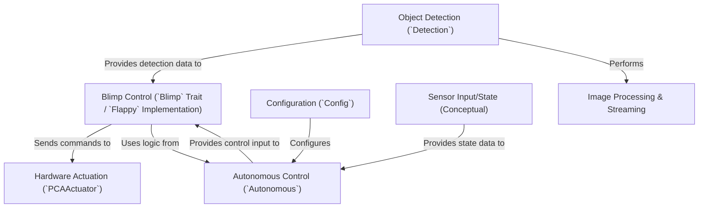

# Tutorial: SanoBlimpSoftware

This project controls a **blimp**, specifically one called *Flappy* or a *SanoBlimp*.
It can be flown **manually** using a gamepad or fly **autonomously** using *computer vision*.
In autonomous mode, it tries to find specific objects using a camera (`Object Detection`), calculates how to move towards them using a *PID controller* (`Autonomous Control`), and sends commands to the blimp's *motors and servos* (`Hardware Actuation`).
Settings like motor power and controller sensitivity can be adjusted via a **configuration** file (`Configuration`).
It also processes the camera image to draw boxes around detected objects and streams this video over the network (`Image Processing & Streaming`).
The blimp uses *sensors* like pressure sensors (for altitude) and IMUs (for orientation) to understand its own state (`Sensor Input/State`).

**Source Repository:** [git@github.com:GMUBlimpSquad/SanoBlimpSoftware.git](git@github.com:GMUBlimpSquad/SanoBlimpSoftware.git)

## Chapters

1. [Blimp Control (`Blimp` Trait / `Flappy` Implementation)](01_blimp_control___blimp__trait____flappy__implementation_.md)
2. [Hardware Actuation (`PCAActuator`)](02_hardware_actuation___pcaactuator__.md)
3. [Configuration (`Config`)](03_configuration___config__.md)
4. [Object Detection (`Detection`)](04_object_detection___detection__.md)
5. [Sensor Input/State (Conceptual)](05_sensor_input_state__conceptual_.md)
6. [Autonomous Control (`Autonomous`)](06_autonomous_control___autonomous__.md)
7. [Image Processing & Streaming](07_image_processing___streaming.md)

