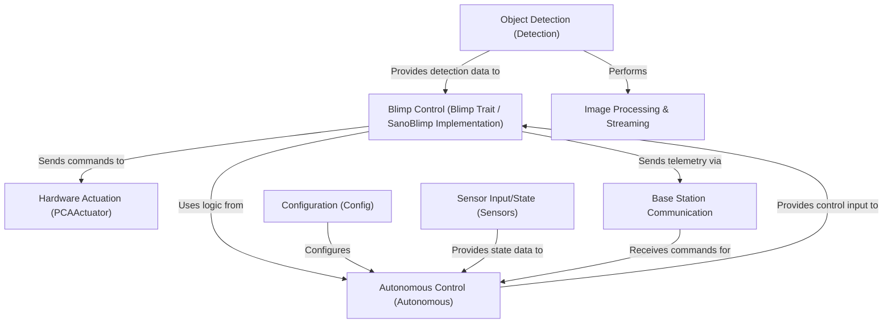

# SanoBlimpSoftware Documentation

Welcome to the SanoBlimpSoftware documentation! This comprehensive guide covers the autonomous blimp control system designed for embedded Linux platforms.

## What is SanoBlimpSoftware?

SanoBlimpSoftware is a robust control system for autonomous aerial blimps written in Rust. The system provides:

- **Dual Control Modes**: Manual flight via gamepad or autonomous navigation using computer vision
- **Real-time Object Detection**: Camera-based object tracking with serial communication
- **PID-based Control**: Position and altitude hold with tunable gains
- **Multi-sensor Integration**: IMU (BNO055) and barometric sensors (BME280)
- **Base Station Communication**: UDP-based telemetry and command interface
- **Hardware Abstraction**: Support for multiple blimp types (Sano, Flappy)

## How It Works

The blimp can operate in two modes:

### Manual Mode
Using a gamepad controller, pilots can directly control the blimp's movement, altitude, and orientation. The system translates joystick inputs into motor commands through a mixing algorithm.

### Autonomous Mode
The blimp uses computer vision to detect and track objects (balls or goals). A PID controller calculates the optimal movements to reach or follow the detected objects. The system continuously:
1. Captures camera frames and detects objects
2. Computes position errors relative to targets
3. Applies PID control to calculate corrections
4. Mixes control outputs into motor commands
5. Sends telemetry to the base station

## System Architecture



## Key Components

### 1. Blimp Control
The core control logic that manages the blimp's state, processes inputs, and coordinates between manual and autonomous modes. Different blimp types (Sano, Flappy) implement the common `Blimp` trait.

### 2. Hardware Actuation
Direct control of motors and servos through the PCA9685 PWM controller. Handles ESC initialization and pulse width modulation.

### 3. Object Detection
Receives detection data from a camera system via serial communication. Identifies and tracks balls or goals using bounding boxes.

### 4. Autonomous Control
PID controller implementation that computes control outputs based on position errors, enabling the blimp to track and follow detected objects.

### 5. Configuration
TOML-based configuration system for tuning PID gains, motor multipliers, network settings, and hardware parameters.

### 6. Sensor Integration
Reads data from IMU (orientation) and barometric sensors (altitude) to provide state estimation for control algorithms.

### 7. Base Station Communication
UDP protocol for bidirectional communication with ground control, sending telemetry and receiving configuration updates.

## Documentation Structure

This documentation is organized into several chapters:

1. **[Blimp Control](01_blimp_control___blimp__trait____flappy__implementation_.md)** - Core control logic and blimp implementations
2. **[Hardware Actuation](02_hardware_actuation___pcaactuator__.md)** - Motor and servo control
3. **[Configuration](03_configuration___config__.md)** - System configuration and tuning
4. **[Object Detection](04_object_detection___detection__.md)** - Computer vision integration
5. **[Sensor Input/State](05_sensor_input_state__conceptual_.md)** - Sensor reading and state estimation
6. **[Autonomous Control](06_autonomous_control___autonomous__.md)** - PID control algorithms
7. **[Image Processing](07_image_processing___streaming.md)** - Video streaming and visualization

## Quick Start

### Hardware Requirements
- Raspberry Pi 4 or compatible ARM64 board
- PCA9685 PWM controller
- BNO055 IMU sensor
- ESCs (BLHeli_S compatible)
- USB camera (for autonomous mode)
- Gamepad controller

### Installation
```bash
# Clone the repository
git clone git@github.com:GMUBlimpSquad/SanoBlimpSoftware.git
cd SanoBlimpSoftware

# Build for Raspberry Pi
cross build --target aarch64-unknown-linux-gnu --release

# Copy to Raspberry Pi
scp target/aarch64-unknown-linux-gnu/release/SanoBlimpSoftware pi@<IP>:~/
scp config.toml pi@<IP>:~/
```

### Running
```bash
# On the Raspberry Pi
sudo ./SanoBlimpSoftware
```

## Getting Help

- **GitHub Issues**: Report bugs or request features at the repository
- **Configuration**: See the [Configuration](03_configuration___config__.md) chapter
- **Hardware Setup**: See the [Hardware Actuation](02_hardware_actuation___pcaactuator__.md) chapter
- **Control Tuning**: See the [Autonomous Control](06_autonomous_control___autonomous__.md) chapter

## Source Code

**Repository:** [git@github.com:GMUBlimpSquad/SanoBlimpSoftware.git](git@github.com:GMUBlimpSquad/SanoBlimpSoftware.git)

## License

See [License](license.md) for details.
